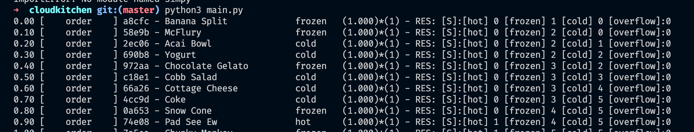
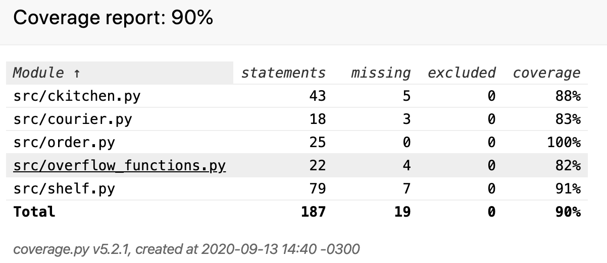

# Engineering Challenge Homework

For the Discrete-Event Simulation of a centralized delivery kitchen, I chose python with simpy to simulate the environment and run the real-time simulation. I found on simpy a simple use of functions generators to solve the resources concurrence problem. I used 'Resource', 'Event', and 'Environment' from simpy as a foundation of our model.

The simpy documentation can be found here: https://simpy.readthedocs.io/en/latest/

## Installation:

### Quickstart:

Run it inside folder project. Make sure you are using python 3.6+

```python
pip install -r requirements.txt

```

Run it on terminal:

```python

python main.py

```

So, this should be enough to run the project and start the simulation:



Each line has the same format: 
| tick  | event   | order_id | order_name | order_temp   | order_value | decayFactor | Resources                        |
|-------|---------|----------|------------|--------|-------|-------------|----------------------------------|
| float | [order] [delivered] [pickup] [wasted] [not found] [moved] [missing] [discard] | hash     | string     | string | float | int         | [hot] [frozen] [cold] [overflow] |


### Events descriptions:
*[order]* - delivery order enter on sistem

*[pickup]* - courier take out order item on shelf

*[wasted]* - order item can not be delivery because it value is less than zero

*[not found]* - courier release order process because the item is not on any shelve

*[moved]* - if overflow shelf is full, this action happens when is possible to move some item to right temp shelf and put the upcomming order on overflow

*[missing]* - when courier look if his order was on pickup area and it was not there

*[discard]* - when the movement is not possible, the item is discarded 

*[delivered]* - when the courier deliver the order.

### Parameters description:
*RANDOM_SEED* - seed to reproduce the data given by a pseudo-random and get same result 

*INTERVAL_ORDERS* = Interval between orders. ex.  0.5 = 2orders/s

*MIN_COURIER_TIME* = Minimum time to courier arrive to get order on pickup area

*MAX_COURIER_TIME* = Max time to courier arrive to get order on pickup area

*OVERFLOW_DECAY_MODIFIER* = Modifier that multiply order value formula to decay faster when they are in overflow shelf.


## Change parameters

### other way to run the simulation 
Inside the project folder, run it:
```
pip3 install ./
ckitchen --interval_orders 0.5 --max_courier_time 6 --min_courier_time 2 --overflow_decay_modifier 2 --normal_decay 1

```

## Test Coverage:


