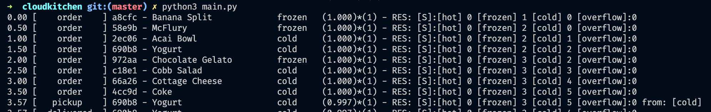

# Engineering Challenge Homework

For the Discrete-Event Simulation of a centralized delivery kitchen, I chose python with simpy to simulate the environment and run the real-time simulation. I found on simpy a simple use of functions generators to solve the resources concurrence problem. I used Resource, Event, and Environment from simpy as our model's foundation.

The simpy documentation can be found here: https://simpy.readthedocs.io/en/latest/

## Installation:

### Quickstart:

Run it inside the folder project. Make sure you are using python 3.6+

```python
pip install -r requirements.txt

```

Run it from terminal:
```python

python main.py

```

So, this should be enough to run the project and start the simulation:



Each line has the same format: 
| tick  | event   | order_id | order_name | order_temp   | order_value | decayFactor | Resources                        |
|-------|---------|----------|------------|--------|-------|-------------|----------------------------------|
| float | [order] [delivered] [pickup] [wasted] [not found] [moved] [missing] [discard] | hash     | string     | string | float | int         | [hot] [frozen] [cold] [overflow] |


### Events descriptions:
*[order]* - delivery order enter on sistem

*[pickup]* - courier take out order item on a shelf

*[wasted]* - order item can not be delivered because its value is less than zero

*[not found]* - courier release order process because the item is not on any shelve

*[moved]* - if the overflow shelf is full, this action happens when is possible to move some item to the right temp shelf and put the upcoming order on overflow

*[missing]* - when the courier look if his order was on the pickup area and it was not there

*[discard]* - when the movement between shelves is not possible, a random item from overflow is discarded 

*[delivered]* - when the courier delivers the order.


## Customizing simulation

The architecture was made to change the simulation parameters easily.


### Changing basic parameters
```python 
def main():
    orders = get_initial_orders()
    parameters = CKParameters()
    parameters.INTERVAL_ORDERS = 0.5
    parameters.MAX_COURIER_TIME = 2
    parameters.MIN_COURIER_TIME = 6
    parameters.OVERFLOW_DECAY_MODIFIER = 2
    parameters.NORMAL_DECAY_MODIFIER = 1
    core = CKitchen(orders, parameters=parameters, factor=1)
    core.simulate()
    core.run(until=30)

```
Definition: 
*RANDOM_SEED* - seed to reproduce the data given by a pseudo-random and get the same result 

*INTERVAL_ORDERS* = Interval between orders. ex.  0.5 = 2orders/s

*MIN_COURIER_TIME* = Minimum time to courier arrive to get the order on pickup area

*MAX_COURIER_TIME* = Max time to courier arrive to get the order on pickup area

*OVERFLOW_DECAY_MODIFIER* = Modifier that multiplies order value formula to decay faster when they are in overflow shelf.

*factor* = Simulation velocity.

### Changing Shelves structure:

The structure of the shelves Coordinator was designed to be is flexible. It is possible to add many shelves as you can with any capacity. Moreover, It is possible to change the full-stack overflow behavior, just sending another function on the constructor. I did that way to build the full-stack overflow logic increasingly with TDD. 

```python 
def main():
    orders = get_initial_orders()
    core = CKitchen(orders, parameters=parameters, factor=1)
    coordinator = ShelvesCoordinator(core, overflow_capacity=1, overflowFullFunc=discard_full_overflow)
    coordinator.addShelf('hot', 1)
    coordinator.addShelf('frozen', 1)
    core.setCoordinator(coordinator)
    core.simulate()
    core.run(until=30)

```


### another way to run the simulation 
Inside the project folder, run it:
```
pip3 install ./
ckitchen --interval_orders 0.5 --max_courier_time 6 --min_courier_time 2 --overflow_decay_modifier 2 --normal_decay 1

```

## Test Coverage:


